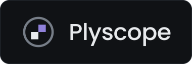

<p align="center">
  
</p>

<h3 align="center">Cada lance sob a lupa.</h3>

<p align="center">
  Revisão de partidas de xadrez com Stockfish 17.1, <b>100% no seu navegador</b>.<br>
  Sem conta, sem servidor, sem mensalidade, sem internet depois do primeiro clique.
</p>

<p align="center">
  <a href="#como-rodar"><b>Como rodar</b></a> ·
  <a href="#o-detector-de-brilhante"><b>Benchmark</b></a> ·
  <a href="#como-a-classificação-funciona"><b>Como classifica</b></a> ·
  <a href="#licença">Licença GPLv3</a>
</p>

<!-- screenshot -->

---

## O que é

O Plyscope pega o PGN de uma partida sua, roda o **Stockfish 17.1** dentro do seu próprio navegador, avalia **todas** as posições e devolve o que o Game Review do chess.com devolve: precisão dos dois jogadores, um selo para cada lance (Brilhante, Excelente, Melhor, Ótimo, Bom, Forçado, Impreciso, Erro, Capivarada), gráfico de vantagem, momentos decisivos e a seta do lance que você deveria ter jogado.

A diferença é onde isso acontece: **na sua máquina**. Nenhuma posição, nome de usuário ou avaliação é enviada para lugar nenhum.

## Por que existe

Analisar a própria partida é a coisa que mais faz alguém melhorar no xadrez — e é justamente a que está atrás do paywall. No chess.com, o Game Review completo é recurso de assinatura; sem ela você tem uma revisão por dia. As alternativas gratuitas quase sempre mandam a sua partida para o servidor de alguém.

O motor que faz esse trabalho é livre (GPL) e roda em WebAssembly há anos. Não existe motivo técnico para cobrar por isso, e não existe motivo nenhum para a sua partida sair do seu computador. Este repositório é a demonstração disso: um `index.html`, uma pasta `engine/`, e acabou.

## O detector de Brilhante

Marcar um lance como **Brilhante (!!)** é a parte difícil: é preciso separar sacrifício correto de peça pendurada. Todo mundo tenta, quase ninguém acerta.

Para não julgar o próprio trabalho no olho, o detector foi calibrado contra o **Brilliant Move Benchmark** — os 100 lances que o Game Review do chess.com marcou como brilhantes em 100 partidas reais. O gabarito é o chess.com; a pergunta é quantos daqueles 100 cada ferramenta também encontra.

| Ferramenta | Brilhantes encontrados |
|---|---|
| Chess.com *(gabarito)* | 100 / 100 |
| Chessigma | 93 / 100 |
| Chessiro | 90 / 100 |
| **Plyscope** | **87 / 100** |
| WintrChess | 45 / 100 |
| Chessitup | 41 / 100 |
| Chesskit | 23 / 100 |

Achar brilhante é fácil se você distribuir confete. Por isso a segunda medição, a que importa tanto quanto: em **8 partidas completas — 416 lances** — o Plyscope encontrou todos os brilhantes do gabarito e marcou **3 lances extras**. É um detector conservador.

Um lance só recebe o selo depois de passar por quatro perguntas:

1. **Foi escolha?** Lance único e legal não tem mérito.
2. **A oferta é real?** O adversário precisa ter uma captura **legal** que ganhe material de fato — troca calculada na casa, não "peça sem defesa". Cravada ou xeque que impede a tomada não conta.
3. **Vale o que ofereceu?** Valem as três formas que o chess.com premia: peça largada em casa atacada, captura que convida a recaptura, e o lance que simplesmente ignora uma ameaça em outro canto do tabuleiro.
4. **Continua de pé?** Depois do sacrifício a posição precisa seguir boa e a partida precisa estar em jogo. Sacrificar já perdido, ou com a vitória no bolso, não é brilhante — a exceção é oferecer uma peça inteira ou mais.

Antes do veredito, todo candidato a sacrifício é **reanalisado com mais profundidade**, porque é exatamente ali que a análise rasa erra: o lance parece um erro até o motor enxergar a continuação.

<!-- screenshot -->

## Recursos

**Entrada**
- Cola o PGN, arrasta um arquivo `.pgn` ou escolhe pelo seletor.
- Busca as últimas partidas públicas pelo seu usuário do **Chess.com** ou do **Lichess** (APIs públicas, direto do navegador, sem login).
- PGN com várias partidas vira uma lista para você escolher.

**Análise**
- Stockfish 17.1 lite em WebAssembly, rodando local — **multi-thread quando a página permite**, single-thread quando não (o app decide sozinho e diz na aba Motor).
- Três profundidades: rápida (12), padrão (16), profunda (20).
- **Segunda passada** automática: lances suspeitos e sacrifícios voltam para o motor com 6 níveis a mais.

**Relatório**
- Precisão dos dois jogadores pelas fórmulas públicas do Lichess.
- Contagem por tipo de lance e **momentos decisivos** da partida.
- Gráfico de vantagem clicável — clique no vale e vá direto para a Capivarada.

**Tabuleiro**
- Barra de avaliação, seta do melhor lance e selo do lance jogado sobre a casa.
- Três melhores linhas do motor, com cada lance clicável.
- **Exploração livre:** clique na peça, clique no destino, o motor avalia na hora. *Voltar à partida* desfaz.
- Reprodução automática com velocidade ajustável (0,6 s a 3,5 s).
- Sons sintetizados no próprio navegador — lance, captura, xeque, roque, promoção, brilhante, erro e fim de partida — com botão de mudo. Nenhum arquivo de áudio.
- Atalhos: `←` `→` navegam, `Home` / `End` vão ao início e ao fim, `F` gira, `espaço` reproduz, `M` muda.

**Interface**
- Escura grafite, layout de aplicativo: o tabuleiro fica sempre visível, sem rolagem.
- Português do Brasil, incluindo o selo **Capivarada** no lugar de "blunder".

<!-- screenshot -->

## Como rodar

### Windows — o caminho curto

Dê **dois cliques em `Abrir Plyscope.bat`**.

Ele liga um servidor local minúsculo (PowerShell, já vem no Windows) e abre `http://localhost:8123/index.html` no seu navegador. Deixe a janela preta aberta enquanto usa; feche para encerrar.

### macOS

Dê **dois cliques em `Abrir Plyscope.command`** — o Finder abre no Terminal, o servidor sobe e o navegador abre sozinho.

Pelo terminal dá no mesmo:

```bash
./plyscope.sh
```

Na primeira vez o macOS pode reclamar que o arquivo veio da internet: clique com o botão direito → *Abrir* → *Abrir*. Se o `.command` não tiver permissão de execução, `chmod +x "Abrir Plyscope.command" plyscope.sh` resolve.

### Linux

```bash
./plyscope.sh
```

O script usa o **Python 3** (que praticamente toda distro já tem) e cai para o **Node.js** se não achar Python. Aceita porta fixa e modo silencioso: `./plyscope.sh 8200 --sem-navegador`.

### Na web

O projeto é estático: `index.html` + `engine/`. Sobe em Vercel, GitHub Pages, Cloudflare Pages ou Netlify sem build nenhum — o passo a passo está em [`docs/PUBLICAR.md`](docs/PUBLICAR.md). O `vercel.json` já serve o `.wasm` com o tipo certo, cache de um ano e os cabeçalhos do modo multi-thread.

### Qualquer outro servidor estático

Serve, mas em **1 thread**: os servidores genéricos não mandam os cabeçalhos `Cross-Origin-Opener-Policy` e `Cross-Origin-Embedder-Policy` de que o motor multi-thread precisa.

```bash
python3 -m http.server 8123      # depois abra http://localhost:8123
# ou
npx serve .
```

### Um thread ou vários

O Plyscope traz dois builds do mesmo Stockfish 17.1 lite e **escolhe sozinho** na hora de abrir:

| Página | Motor | Threads |
|---|---|---|
| servida com `COOP: same-origin` + `COEP: require-corp` | `engine/stockfish-lite.js` | `hardwareConcurrency − 1`, no máximo 8 |
| qualquer outra | `engine/stockfish-lite-single.js` | 1 |

Esses dois cabeçalhos deixam a página *cross-origin isolated*, que é a condição do navegador para liberar o `SharedArrayBuffer` — e sem `SharedArrayBuffer` não existe WebAssembly com threads. Os atalhos do Windows, do macOS e do Linux já os mandam, e a Vercel também. A aba **Motor** mostra em que modo você está.

Se o multi-thread não subir (navegador antigo, memória curta), o app volta sozinho para o single-thread, sem aviso e sem quebrar nada.

**E a busca no Chess.com e no Lichess?** Continua funcionando com os cabeçalhos ligados. O `COEP: require-corp` só barra requisições em modo `no-cors`; o app busca as partidas com `fetch(..., { mode: "cors" })`, e as duas APIs respondem com `Access-Control-Allow-Origin`, o que basta. Foi por isso que o `require-corp` foi preferido ao `COEP: credentialless`: `credentialless` resolveria o mesmo problema, mas [o Safari não o implementa](https://developer.mozilla.org/en-US/docs/Web/HTTP/Reference/Headers/Cross-Origin-Embedder-Policy) — quem usa Safari ficaria sem multi-thread à toa.

**Por que os 7 MB do motor multi-thread estão no repositório.** Foi avaliado baixar sob demanda com um script, e não compensa: não há passo de build aqui (a Vercel publica o repositório como está, e o `.bat` do Windows não roda instalador nenhum), então um download sob demanda significaria ou um passo manual antes do primeiro uso, ou o site publicado sem o arquivo — nos dois casos o multi-thread simplesmente não aconteceria. O repositório já carregava 7 MB do build de 1 thread; passar para 14 MB de binário que quase nunca muda é barato perto de trocar "dois cliques e funciona" por "rode o script antes". Os dois `.wasm` estão marcados como binários no `.gitattributes`, então o Git não tenta versionar diferenças deles.

### Por que não dá para abrir o `index.html` direto

Clicar duas vezes no `index.html` abre a página em `file://`, e aí o app carrega mas **não analisa**. Dois motivos, os dois do navegador e não do app:

- **WebAssembly:** em `file://` a origem é opaca (`null`), e o navegador recusa instanciar o módulo `.wasm` do Stockfish — costuma reclamar de MIME type ou de CORS.
- **Web Worker:** o motor roda numa thread separada, e criar um Worker a partir de `file://` também é bloqueado por política de mesma origem.

Um servidor estático local resolve os dois. Ele serve os arquivos por `http://localhost` e continua sendo tudo local: **nada trafega para fora da sua máquina** — dá para desligar a internet depois de abrir a página e a análise continua funcionando.

> A primeira análise carrega o motor do disco (≈ 7 MB de `.wasm`) e demora alguns segundos a mais. As seguintes são instantâneas.

## Estrutura

```
plyscope/
├─ index.html                     o app inteiro: interface, tabuleiro, chess.js e a análise
├─ Abrir Plyscope.bat             atalho do Windows
├─ Abrir Plyscope.command         atalho do macOS (duplo clique no Finder)
├─ plyscope.sh                    atalho do macOS e do Linux, pelo terminal
├─ servidor.ps1                   servidor estático em PowerShell, porta 8123
├─ engine/
│  ├─ stockfish-lite-single.js    Stockfish 17.1 lite, 1 thread (nmrugg/stockfish.js)
│  ├─ stockfish-lite-single.wasm  ~7 MB
│  ├─ stockfish-lite.js           o mesmo build, multi-thread
│  └─ stockfish-lite.wasm         ~7 MB
├─ src/                           fontes — o index.html é gerado a partir daqui
│  ├─ shell.html                  HTML + CSS (tokens, layout)
│  ├─ app.js                      análise, classificação, tabuleiro, som
│  ├─ build.py                    junta tudo num index.html só
│  ├─ vendor/chess.esm.js         chess.js (regras, PGN, FEN)
│  └─ assets/pieces.svg           sprite das peças
├─ tools/
│  ├─ servidor.py                 servidor estático em Python 3 (macOS/Linux)
│  ├─ servidor.js                 o mesmo em Node.js, para quem não tem Python 3
│  ├─ test.js                     (dev) teste ponta a ponta em jsdom, com Stockfish de verdade
│  ├─ calibrar.js                 (dev) mede o detector de Brilhante contra o benchmark
│  └─ tune.js                     (dev) busca em grade dos limiares
├─ docs/
│  ├─ MANUAL.md                   manual do usuário final
│  ├─ BENCHMARK.md                como a calibração foi feita e medida
│  ├─ PUBLICAR.md                 subir no GitHub e na Vercel
│  └─ exemplos/opera-1858.pgn     partida para testar em 10 segundos
├─ brand/
│  ├─ logo.svg  mark.svg  icon.svg  favicon.svg
│  └─ BRAND.md                    nome, paleta, uso do logo, tom de voz
└─ LICENSE                        GPLv3
```


Para reconstruir o app depois de mexer em `src/`:

```bash
python3 src/build.py
```

Para testar antes de publicar (roda o Stockfish de verdade, ~35 s):

```bash
cd tools && npm install && node test.js ../docs/exemplos/opera-1858.pgn
```

O `build.py` injeta o sprite, o chess.js e o `app.js` nos três marcadores do `shell.html` (`<!--__PIECES__-->`, `/*__CHESSJS__*/`, `/*__APP__*/`). Não remova esses marcadores.

## Como a classificação funciona

O critério **não é centipeão**. Perder 1,0 de avaliação numa posição equilibrada joga a partida fora; perder 1,0 quando você já está +8 não muda nada. Contar centipeão trata os dois casos como o mesmo erro — e é por isso que ferramentas que fazem isso enchem a sua partida ganha de "erros".

O Plyscope usa **chance de vitória** (win%), a mesma ideia do Lichess e do chess.com. A avaliação do motor vira probabilidade de vitória por uma curva sigmoide, e o que se mede é **quanta chance de vitória o lance jogou fora**:

| Selo | Critério |
|---|---|
| **Brilhante (!!)** | Sacrifício correto — passou pelas quatro perguntas lá de cima. |
| **Excelente (!)** | Achou o único lance que segurava a posição. |
| **Melhor (★)** | Igual à primeira escolha do motor. |
| **Ótimo / Bom (✓)** | Perdeu pouquíssima chance de vitória. |
| **Forçado (=)** | Só existia esse lance legal. |
| **Impreciso (?!)** | Perdeu de 5% a 10% de chance de vitória. |
| **Erro (?)** | Perdeu de 10% a 20%. |
| **Capivarada (??)** | Perdeu mais de 20%. |

**Precisão** sai das fórmulas públicas do Lichess: a perda de chance de vitória vira precisão do lance, e a precisão da partida é a média entre a média ponderada pela volatilidade da posição e a média harmônica. Os números ficam próximos dos do chess.com, mas não idênticos — a fórmula deles é fechada.

## Créditos

Este app é uma casca em volta de trabalho de outras pessoas:

- **[Stockfish](https://stockfishchess.org/)** — o motor. GPLv3. Build WebAssembly de **[nmrugg/stockfish.js](https://github.com/nmrugg/stockfish.js)** (`stockfish-17.1-lite-single`). Licença completa em `engine/LICENSE-stockfish-GPLv3.txt`.
- **[chess.js](https://github.com/jhlywa/chess.js)** — regras, geração de lances, PGN e FEN. Licença BSD.
- **Peças** — sprite do **[cm-chessboard](https://github.com/shaack/cm-chessboard)**, desenhadas por **Cburnett** (Wikimedia Commons), **CC BY-SA 3.0**. Se você redistribuir as peças, mantenha a atribuição e a mesma licença.
- **[Lichess](https://lichess.org)** — pelas fórmulas de precisão e de chance de vitória, publicadas e explicadas.
- **Chess.com** — pelo Game Review, que é o alvo de comparação, e pelo Brilliant Move Benchmark ter um gabarito para medir.
- **Poppins** (SIL OFL) — o logotipo foi desenhado a partir dela e convertido em curvas.

## Licença

**GPLv3.** Não por preferência ideológica: o **Stockfish vai dentro deste repositório**, e o Stockfish é GPLv3. Distribuir o motor junto com o app torna o conjunto uma obra derivada — a GPLv3 é a única licença possível para essa distribuição, e é a certa.

Na prática: use, estude, modifique e redistribua à vontade; se distribuir uma versão modificada, ela também precisa ser GPLv3 e vir com o código.

O chess.js é BSD (compatível) e as peças são CC BY-SA 3.0, que exige atribuição — as duas coisas estão preservadas nos créditos acima.

## Roadmap

Curto e honesto. Sem datas.

- [ ] **Subir de 87 para 90+ no benchmark.** Os 13 casos que faltam estão mapeados: quase todos são sacrifício posicional de longo prazo, onde a compensação só aparece bem depois da profundidade que a segunda passada usa.
- [ ] **Nome da abertura no relatório** (ECO). Hoje o relatório começa no lance 1 sem dizer o que foi jogado.
- [ ] **Salvar as análises** no navegador, para reabrir a partida sem reanalisar.
- [ ] **Exportar o relatório** como imagem ou PGN comentado.
- [ ] **Launcher para macOS e Linux** — hoje só existe o `.bat`; nos outros sistemas é `python3 -m http.server` na mão.
- [ ] **Stockfish multi-thread**, que é bem mais rápido. Exige servir a página com os cabeçalhos `COOP`/`COEP`, o que o servidor de uma linha não faz — precisa ser opcional, e sem quebrar quem usa o `.bat`.
- [ ] **Interface em inglês.** Hoje é só pt-BR. O `Capivarada` fica.

**Fora de escopo, de propósito:** conta de usuário, backend, ranking, banco de partidas na nuvem, análise "com IA" que não seja o motor. Se um recurso exige servidor, ele não entra.

---

<p align="center">
  <sub>Feito para quem quer entender a própria partida sem pedir licença — nem pagar por isso.</sub>
</p>
